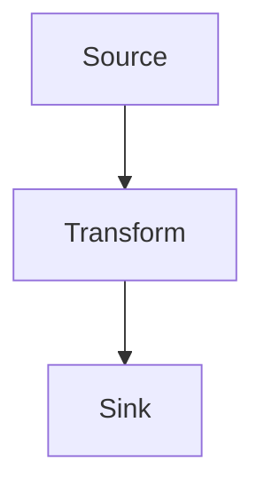

# Feat

Single-pass planning: brainstorm + implementation plan in one document.

1. **Plan** — prepare a testable worktree (only if pwd is empty), write the plan, wait for review, iterate. Never create a branch here.
2. **Implement** — on `go`.
3. **Iterate** — per fix: commit, push, and post a changes link.

## Rules

- A request to add, fix, update, build, or implement something is not a request for a plan.
- `go` enters Phase 2 only when this conversation already has an explicit feat plan.
- No ceremony: no separate spec docs, no decomposition rituals, no hard gates.
- Clarifying questions only when truly ambiguous; approaches only on a real trade-off.
- Every new file/function named in the plan ships with its full code.

## Working rules

- For every complex request, inspect the relevant codebase before proposing or making changes.
- Before starting work, read the recent commits (e.g. `git log`) and the last commit's changes (e.g. `git show HEAD`) to understand the context first.
- Do not run lint, tests, typechecks, builds, or similar slow verification after each change. Batch verification immediately before committing, pushing, or when the user explicitly requests it.

## Phase 1 — Plan

### 0. Resolve the working copy (before anything else)

```bash
[ -z "$(ls -A .)" ] && echo empty || echo non-empty
```

- **Empty** → build the worktree per [Worktrees](#worktrees) before reading context or exploring. Slug comes from the pwd, else derive 3-6 kebab-case words.
- **Non-empty** → use the current checkout; no worktree. Derive the slug from the task; plan bullet becomes `- Repo: <path>` unless the pwd is a worktree slug dir.

Either way, read every `AGENTS.md` level from the checkout up to the workspace root — it owns the worktree layout, local-file copy table, and PR template additions. Per-repo `AGENTS.md`, `AGENTS.local.md`, and `CLAUDE.local.md` files have to be read from disk. When the pwd is a worktree you did not create this session, audit its setup and repair what is missing before editing: workspace `AGENTS.md` symlink in the slug dir, untracked local files (compare contents), dependencies.

Record base branch + path. **Before creating the plan file**, run the following from every repository directory:

```bash
gh pr view --json url -q .url
```

If a PR exists, the plan must include its URL from the first version; never wait until Phase 2 to add it. A missing PR link when `gh pr view` succeeds is a plan defect. No matching PR is valid and does not block planning. Never create or check out a branch in Phase 1.

### 1. Read linked context

Read the task itself — issue, Notion page, ticket, PR description — plus any referenced Slack thread. Attachments often return filenames only — download and read them (screenshots often define the target).

**Take intent from the task, never conclusions.** Trust it for the symptom, the desired behavior, and the acceptance criteria. Every technical claim it makes — a named cause, file, function, API shape, or a whole `## Investigation` section — is one person's hypothesis, possibly written against older code, and it is often wrong. Treat each claim as a question to answer in step 2, and never let the task be the evidence behind a plan decision.

### 2. Explore via subagent

Spawn Cursor's built-in `explore` agent (read-only) via the Task tool (`subagent_type="explore"`) against the working copy. Do not explore in the parent, invent a custom subagent, or use a general-purpose worker. Keep parent context lean. Ask only for: files to change, patterns in that area, `AGENTS.md`/`package.json` conventions, test framework + layout, recent commits touching it.

Omit `model` so Cursor applies **Settings → Agents → Explore subagent model** (or the product default when unset). Do **not** pass `inherit` or a slug — both override that default. There is no agent API to read the current slug.

Thoroughness: `"quick"` for tiny tasks, `"medium"` for features and bugs. `"very thorough"` only when genuinely cross-cutting.

Give the subagent the symptom or goal, not the task's answer. A prompt that repeats the task's proposed cause, file list, or fix gets that answer confirmed back with fresh-looking citations. Pass the task's claims separately, as checks to accept or reject — "the task says X; verify or refute it in code" — and ask which ones the code contradicts. Explore yourself when the report reads like the task reworded.

**Bugs / review regressions:** the step 1 bar is strictest here. Demand evidence-backed root cause with file paths and line numbers (call sites, data flow, validation vs display, asset/rate sources, tests). Reject "likely because…" without code proof. The confirmed cause becomes the plan's `## Cause`, even when it contradicts the task's investigation.

```
Task tool, subagent_type="explore"
(omit model)
prompt: "Bug: <symptom>. Do NOT guess from the description. Read the code end-to-end (entry → convert/validate/display → confirm). The task claims <claim>, treat it as unverified. Return: (1) root cause with paths + line numbers, (2) why the symptom happens, (3) rejected hypotheses with code evidence, (4) whether each task claim holds, (5) minimal fix matching existing patterns, (6) tests to add. Thoroughness: medium."
```

### 3. Ask — only if ambiguous

One question at a time, multiple-choice, only when the answer changes what gets built. Stop as soon as you can plan responsibly.

### 4. Two approaches — only on a real trade-off

Otherwise pick the obvious answer and note why in the plan. When presenting: recommendation first, one-line trade-off each.

### 5. Write the plan

**Follow [Write Plans](#write-plans) exactly.** It owns file location, naming, code coverage, diff format, ordering, narratives, and the pre-save audit. Working copy is already resolved — do not create one here.

Feat-specific:

- No commits in the plan body; the implementer commits per logical chunk.
- Constant referenced but defined elsewhere → add a one-line plan-only comment immediately above its use with the human-readable value (`// TIMEOUT: 15 seconds`). Omit these annotation comments when implementing the code.
- The plan states verified behavior only. Where the code contradicts the task, write the verified version and never the task's — then flag the contradiction in step 6 so the user can correct the task.
- Bugs get `## Cause` and `## Fix` right after `## Goal`, always as a pair; a bug-fix plan missing either is a defect.
- `## Cause` and `## Fix` are skim sections: a reader who stops after them must already know the diagnosis and the remedy. Evidence, history, rejected hypotheses, and how the code works belong in research — not here. Paths, symbols, and flag values stay in the change sections unless the cause cannot be stated without one.
- Write `## Cause` as **1–2 short sentences**. Name only the decisive mismatch (two sources, wrong order, missing gate). Cut chronology, background, and "why it used to work."
- Write `## Fix` as **≤3 one-line bullets**, one per moving part, ordered like the change sections. Name the new behavior only — do not restate the cause, and do not explain why (change-section narratives own that). Drop cleanup/wiring bullets that do not change the outcome.
- Tie each change section back to the cause it removes in that section's narrative, so no fix arrives unexplained.
- Tiny features use one `## Changes` section with one `###` step. Brevity comes from absent sections, never from omitted code.
- Start with the unheaded top bullet list. Always include every PR that already exists before the plan is created; append only genuinely new PR links in Phase 2.
- New projects only: add exactly two one-line bullets after `Worktree`: `- Server: Cloudflare Workers, D1, Better Auth` and `- Client: React, Tailwind CSS, shadcn/ui`. The client line must name the styling method; name only the important technologies and omit both bullets for existing projects.
- Always include `## Next step`.

#### Plan prose

Applies to every sentence in the plan file, including later edits. The code carries the plan; text only adds what code can't show. Budget: `## Goal` ≤ 3 sentences, `## Cause` ≤ 2 short sentences, `## Fix` ≤ 3 one-line bullets, each narrative ≤ 2, each other bullet 1 line.

Write:

- **Why this way** — the constraint that forces the design, the rejected alternative and its failure, a verified API quirk or gotcha.
- **Concrete nouns** — file, function, param, number, tag, error. `politics phases start only after the main feed's cursor is exhausted`, not `we ensure proper ordering`.
- **Imperative present** — `Partition politics out of the shuffle.` Not `We will need to make it so that…`.

Cut:

- Restating the title, goal, ticket, or a previous section.
- Narrating the diff (`this adds a param`, `then we call the helper`) — the reader sees it.
- Filler and hedging: `in order to`, `it's important to note`, `basically`, `simply`, `as mentioned above`, `robust`, `clean`, `properly`, `seamlessly`.
- Background lectures on how the framework/library works.

Bad → good:

- `In order to make sure that the ordering works properly, we will need to update the client so that it can handle the different phases correctly.` → `Each category maps to an ordered phase list; only trending has more than one.`
- `This is an important step because pagination is involved.` → `Cursors are per-phase, so a phase change must drop the stored cursor.`

Audit before saving: reread each sentence; if deleting it loses nothing, delete it.

#### Plan template

`````markdown
# Title

- Slug: `<slug>`
- Base: `<base-branch>` (one bullet per repo)
- Worktree: `<path>` (or `- Repo: <path>`; one bullet per repo)
- Server: `<important runtime, database/storage, and auth technologies>` (new projects only)
- Client: `<important frontend, styling method, and UI technologies>` (new projects only)
- Slack: <thread>
- Issue: <url>
- PR: <url> (single PR)
- <prefix> PR: <url> (one per repo or stack layer when multiple)

## Goal

≤3 sentences: what and why (see Plan prose). Bullets only for non-obvious directional context. Never restate the title.

## Cause

(Bugs only, always paired with `## Fix`; omit both for features. 1–2 short sentences: the decisive mismatch only.)

## Fix

- <new behavior, one line>
- <next moving part, one line>

## Diagram

(Optional — only for multi-component flows, new abstractions, or cross-package data movement.)



## <Feature flow> Changes

(Group by flow stage, never by repo — one stage may mix repos. Name it after the stage, e.g. `## Warm the quote on amount entry`. Tiny features: one `## Changes`. Order sections and `###` steps by runtime/reading order, defining each thing where it's first used.)

### Action + Thing

(≤2 sentences: why this step is shaped this way and how it follows the previous one — never narrate the diff. Introduce helpers used here.)

[`repo-relative/path/to/new-file.ext`](repo-relative/path/to/new-file.ext)

```lang
export function realCode(input: InputType): OutputType {
  return doTheThing(input)
}
```

### Update Thing

(≤2 sentences.)

[`repo-relative/path/to/existing-file.ext`](repo-relative/path/to/existing-file.ext)

```diff
 export function existingCode(input: InputType): OutputType {
   const config = loadConfig()
-  return doTheThing(input, config)
+  return doTheThing(input, config, { retries: 3 })
 }
```

## Tests

(Bullets only — no test code. Each names the unit + behavior.)

- `<unit>`: <behavior>; <edge case>.

## Verification

```bash
yarn lint:changed
yarn test <focused scope>
yarn typecheck
```

## Next step

Wait for the user to review and update the plan. When ready, reply **`go`** to follow the `feat` skill and continue with Phase 2 — implement, create the branch, and open a draft PR.
`````

### 6. Hand off

```markdown
- Plan: [`<file>`](/absolute/path/to/plan/<file>)
- Task correction: <the task's claim> is wrong — <what the code does>. (Only when research refuted the task; one bullet each.)
- Review it, then say **`go`** to implement, create the branch, and open a draft PR — or tell me what to change.
```

Resolve `~` to the absolute home path so Cursor can open it. Then **stop**. On change requests, edit the plan in place and re-ask.

## Phase 2 — Implement

Only on `go`. Working copy is already resolved.

### 0. Check working copy state

Run `git status --porcelain`. If dirty, stop and ask how to proceed — never stash, reset, or commit pre-existing changes. Record dirty paths; every commit stages only files this implementation touched via explicit `git add <path>` (never `git add .` / `-A` / `commit -a`).

### 1. Pull the base

```bash
git -C <working-copy> fetch origin <base-branch> --prune
```

- Prepared worktree, no feature commits → `git -C <working-copy> checkout --detach origin/<base-branch>`.
- Existing checkout → branch off `origin/<base-branch>` in step 2, not the local base.

Fetch fails → ask: stale base or abort.

### 2. Implement

- Work top-to-bottom through the plan; produce data before consuming it.
- Apply each change as written. Reality diverges → fix the plan file first, then implement.
- Create the Phase 1 branch from `origin/<base-branch>` before the first commit. Use the same branch name in every repo touched by one feature.
- Commit per logical chunk, staging only your files. Lint changed files before each commit (per the repo's `AGENTS.md`).
- Write the tests described in `## Tests`.

### 3. Verify

Run the plan's `## Verification` commands. Fix failures before committing or pushing.

### 4. Push

- Push while opening the draft PR in step 5. Use `git push -u origin HEAD` for the new branch.
- Before any push, follow the target repo's required pre-push checks. If the remote diverged, stop and resolve it safely rather than force-pushing without confirmation.
- After every push, follow the push-link rules in [Pull Requests](#pull-requests).

### 5. Draft PR per repo

**Follow [Pull Requests](#pull-requests)** — it owns the base branch, title rules, body template, link bullets (`Closes:`, `Slack link:`, `Depends on`), and the `gh-stack` workflow. Apply the target repo's `AGENTS.md` PR additions on top.

Feat-specific: reuse a PR recorded in Phase 1 instead of creating a duplicate. If none exists, open the PR as a draft (`gh pr create --draft`, or `gh stack submit` which drafts by default).

A bug-fix PR carries the plan's `## Cause` and `## Fix` into one `## Cause and fix` section between `## Summary` and `## Test Plan` — cause first (1–2 sentences), then the same short fix bullets. Keep it skim-sized and behavioral so it survives repo `AGENTS.md` rules that hold PR bodies to an overview; add at most one checkable fact (a measured timing, a callback order) only when the diagnosis is otherwise unverifiable. Omit the section for a pure feature.

Append newly created PR URL(s) to the plan's top bullet list. Use `- PR: <url>` for one PR and `- <prefix> PR: <url>` for multiple PRs, where the prefix identifies the repo or stack layer. Every repo involved gets a bullet, including dependency repos whose PR this plan did not create; preserve links recorded in Phase 1.

### 6. Report

Scannable sections, one-line bullets, no prose. Omit sections that don't apply. Don't restate the plan.

```markdown
# Status

- <verification passed / checks still failing>

# Changes

- <meaningful change, one line each — a few bullets, not every file>

# Test

- Worktree: `<path>` (or `Repo: <path>`)
- Branch: `<name>`
- Run: `<command>`

# Links

- PR: <draft-pr-url>
```

- A created worktree must already be testable — no install or build step for the user.
- `# Links` is always last after a push; one bullet per repo. A new PR's first report has no changes link yet.

Record `git -C <working-copy> rev-parse HEAD` per repo as the Phase 3 baseline.

## Phase 3 — Iterate

Each fix is committed and pushed.

One fix = one loop, not a batch at the end. A fix = any change from review feedback, CI failures, or follow-ups.

1. Lint changed files (per the repo's `AGENTS.md`), commit with a short message.
2. Run `git -C <working-copy> push`.
3. After a push, post the changes link, then advance the baseline. URL format, baseline handling, and `gh` commands live in [Pull Requests](#pull-requests).

```markdown
# Changes

- <what this fix did, one line each>

# Links

- PR: <pr-url>
- Changes: <changes-link-for-this-push>
```

One bullet per repo when multiple. Omit `Changes:` when it equals the PR link.

---

# Write Plans

How to write the plan file produced in Phase 1 step 5.

**Save to:** in worktree pwd mode (pwd under `~/worktree/<project>`), save to `~/worktree/<project>/YYYY-MM-DD-<slug>.md` — the plan lives next to the repo worktrees in the slug dir. Otherwise fall back to `~/plans/YYYY-MM-DD-<slug>.md` (create the directory if missing). Slug is kebab-case, 3-6 words, descriptive (e.g. `2026-05-10-bump-http-timeout.md`). If today's filename collides, append `-2`, `-3`, etc.

**Rules:**

- Write actual code blocks, exact paths, exact commands.
- **The plan must cover all the code.** Every new file, new function/method/hook/class/type/schema, and every non-trivial behavior change must appear as real code or a real diff in the plan. Naming a symbol in prose, a wiring note, a bullet, or a call site is not enough — if the implementer would have to invent the body, the plan is incomplete.
- **Plan code is production code.** Show the real fix/feature source; do **not** write test code in the plan. Describe tests as bullets (what to test, unit + behavior), never `expect(...)` / `it(...)` blocks.
- **No prose-only implementations.** Forbidden: "implement X that does Y", "use Redis/mutex/schema to …", "handle failure by …", or similar instructions that describe behavior without showing the full function/file. Write the complete code instead.
- **Code blocks contain real code.** No `// ...rest of function`, `// TODO`, or `// add error handling`. New files and wholly new declarations must be complete. Modification diffs may use `...` as a non-literal display marker to collapse irrelevant *unchanged* code. Every non-ellipsis added or removed line must still be real code. Never use `...` to omit new logic the implementer must write.
- **Every code block is preceded by its file path**, linked: `[`repo-relative/path/to/file.ext`](repo-relative/path/to/file.ext)`. A code block without a file path is a defect.
- **Keep comments in code blocks minimal**, preserving existing comments in rewrites, and remembering that minimal ≠ zero. Every comment in a plan code block is ONE line max.

## Diffs

- **Editing existing code → show a concise, independently understandable diff.** Use a ```diff fenced block. **Diff markers must be accurate:** lines that already exist in the file are unchanged context (leading space), only genuinely added lines get `+`, only genuinely removed lines get `-`. Never mark an existing declaration (e.g. an existing method being modified) entirely with `+` — that misrepresents the change.
- **Never show orphan code in a diff.** Every hunk must show the named enclosing declaration in unchanged context (function, method, hook, class, object, schema, or type). A shortened marker such as `async #withdraw(...) {` is acceptable. A bare statement is invalid unless its enclosing name is visible in that hunk.
- **Markdown diffs must show their section.** Every hunk editing an existing Markdown file must include the nearest parent heading above the changed lines as unchanged context. If that heading is being changed, also include its nearest unchanged ancestor heading.
- **Keep disjoint scopes in distinct hunks.** Separate diff blocks (or a real multi-hunk unified diff) per scope; never splice non-adjacent fragments into one continuous-looking snippet.
- **New files or wholly new declarations → show a complete regular code block** in the project's language. Diffs are only for modifications. A new file's plan block must include every export the rest of the plan imports from it.

### Code template

Copy this shape for each modified file. Delete scopes that do not apply; keep disjoint scopes in separate blocks and show new declarations in complete language blocks.

`````markdown
[`repo-relative/path/to/file.ext`](repo-relative/path/to/file.ext)

Explain the import change in one sentence.

```diff
-import { OldDependency } from 'package'
+import { NewDependency } from 'package'
```

Explain the field or wiring change in one sentence.

```diff
 export class Feature {
   ...
+  readonly #dependency: Dependency
   ...
 }
```

Explain the behavior change in one sentence.

```diff
 async run(...) {
   ...
-  return oldFlow(input)
+  return newFlow(input, this.#dependency)
   ...
 }
```

Introduce a wholly new declaration with complete code.

```ts
type Dependency = {
  run(input: Input): Promise<Output>
}
```
`````

### Markdown template

Include the nearest parent heading as unchanged context so the destination section is visible.

`````markdown
[`repo-relative/path/to/file.md`](repo-relative/path/to/file.md)

Explain why this section changes in one sentence.

```diff
 ## Parent section
 
-Old rule.
+New rule.
```
`````

## Plan structure

- **Lead with the core solution.** The first change section is the critical mechanism that actually fixes/builds the thing — not setup, wiring, or dependency injection. A reader must grasp the heart of the fix from the first screen, then read top to bottom with supporting changes following in order.
- **Write the plan linearly (waterfall), in reading/flow order.** Order steps the way the code executes or a reader follows it end-to-end. Introduce each helper right where it's first used rather than clustering helpers at the top.
- **Precede each code block with a short narrative (1-3 sentences)** explaining the step and how it connects to the previous one.
- Paths are repo-relative, never absolute. Link them inline when referenced.
- **Audit coverage before saving.** Walk every import, call, and named symbol the plan introduces; confirm each new/changed one has its full implementation (or exact changed lines) in a code/diff block. Also audit each block: file path present, named declaration visible, correct diff markers, no placeholders, no multi-scope splices, no test code.

---

# Worktrees

When this workflow requires a new worktree, prepare it before gathering linked context, exploring code, asking implementation questions, or writing a plan. The only allowed prerequisites are identifying the target repo and reading the applicable `AGENTS.md` files.

**Applicable `AGENTS.md` files means every level, not just the repo.** Walk up from the worktree to the workspace root and read each `AGENTS.md`, `AGENTS.local.md`, and `CLAUDE.local.md` on the way, plus any per-project files those list. A repo-level `AGENTS.md` never supersedes the workspace one — the workspace file holds the worktree layout, local-file copy table, and PR template additions. That content is inlined in [Worktree map](#worktree-map).

**A pre-existing worktree is not a prepared worktree.** When you start work in a worktree you did not create this session (or the pwd already contains one), audit it before the first edit and fix whatever is missing: the workspace `AGENTS.md` symlink in `<SLUG_DIR>`, the untracked local files from the workspace copy table (compare contents — a stale placeholder counts as missing), and installed dependencies.

## Worktree pwd mode

If the current pwd contains `worktree` (for example, `~/worktree/<slug>`), treat it as the pre-created slug directory, not the worktree itself. Name the feature branch `guten/<slug>`.

**The workspace `AGENTS.md` owns the naming map** — see the table in [Worktree map](#worktree-map) for the source repo path and worktree folder name per repo, including any repo that splits into more than one worktree. Never guess a folder name from the repo name when that file has a row for it.

Keep the slug directory as a non-repository container. Create every repository in its own `<SLUG_DIR>/<WORKTREE_FOLDER>` subdirectory. If the target repo is ambiguous, ask the user to choose before setup.

Outside worktree pwd mode, derive a 3-6 word kebab-case slug from the task, use it for the feature branch, and take the folder name from that same map, defaulting to `~/worktree/<slug>/<WORKTREE_FOLDER>`.

## Create and prepare

1. Read the workspace and source repo `AGENTS.md` files (every level, per the rule above).
2. Resolve the base from the latest remote default branch unless the user explicitly named another base:

```bash
git -C <SOURCE_REPO> symbolic-ref refs/remotes/origin/HEAD --short
```

Strip the leading `origin/` from the result. If the command fails, check `main`, then `master`.

3. Fetch the base before creating the worktree:

```bash
git -C <SOURCE_REPO> fetch origin <base-branch> --prune
```

If fetch fails, ask whether to continue from the stale local ref or abort.

4. Create the worktree from the remote-tracking ref:

```bash
git -C <SOURCE_REPO> worktree add <WORKTREE_PATH> origin/<base-branch>
```

5. Apply the workspace layout rules. Always symlink the workspace `AGENTS.md` into `<SLUG_DIR>` — including single-repo slugs, since it is the only thing that leads a later session to the workspace rules — and add sibling repo symlinks only when the task needs them.
6. Never move the agent root. Do **not** call the `cursor-app-control` MCP tool `move_agent_to_root` (or `move_agent_to_cloned_root`), and do not call `SetActiveBranch`. Confirmed root cause of Cursor labeling the sidebar with the parent repo name instead of the slug folder: these tools register repo/branch metadata with the client.
7. Make each worktree immediately testable: install with the repo's package manager, copy required untracked local config from the source repo (use the copy table in [Worktree map](#worktree-map) — path list and `cp` flag per repo), run required build/codegen, and run the quickest health check.

Never symlink `node_modules`. All subsequent reads, edits, and repo-local commands must run in the worktree, not the source repo.

---

# Pull Requests

Review-and-ship workflow when opening or updating a PR:

1. Review the diff against the base branch and identify behavior-impacting risks (`git fetch origin main`, `git diff origin/main...HEAD`, `git status`).
2. Run or update tests for changed behavior.
3. Fix critical issues before finalizing.
4. Commit selective files with a concise message.
5. Push the branch and open or update the PR.

Guardrails:

- Prioritize correctness, security, and regressions over style-only comments.
- Keep commits focused; avoid unrelated file changes.
- If pre-commit checks fail, fix the issues rather than bypassing hooks.

Base branch and repo-specific additions (extra checklist lines, required labels, always-present sections) come from the target repo's `AGENTS.md`; re-read it before writing the PR and apply its additions on top of the template below.

PR title:

- Conventional Commits: `type(scope): message`, e.g. `fix(payments): backfill missing address`.
- State the concrete change, not a theme. Bad: `identify wallet exchange requests`. Good: `set App-Name: exodus-predictions for wallet exchange requests`.
- Follow the repo's `AGENTS.md` convention. Same title across repos for one feature.
- A PR that depends on an unmerged PR stays a **draft** (`gh pr ready --undo`, or `gh pr create --draft`), except `gh stack` layers. Mark it ready only after every dependency merges.

PR description:

- Summary is plain language a non-developer understands: no code, no jargon, short.
- Include every section heading even when empty.
- Add related links: any Slack threads or other links provided for the task, and any PRs this PR depends on.
- `Closes:` — when it resolves an issue, using the `Closes <issue-link>` format.
- `Slack link:` — public/shared channel threads only.
- `Depends on` — its own block after the summary bullets, one bullet per dependency labelled with the short repo/artifact name (`pay`, `schema`, `assets`). Required whenever this PR depends on an unmerged PR elsewhere; pair it with draft state, and drop both once the dependencies merge. A missing `Depends on` block on a cross-repo dependent PR is a defect.
- Only links other reviewers can open. Never: local plan files, private DMs, local paths.
- Immediately before updating a PR description, re-read the current body after all analysis is complete; never write from an earlier snapshot.
- Merge into that fresh body and preserve every user-added section, link, image, video, and note unless the user explicitly asks to remove it. When the API replaces the whole body, fetch and modify it in the same command where practical.

`````markdown
## Summary

<one or two sentences>

- <main changes, one line each>

- Closes: <issue-link>
- Slack link: <public-thread>

Depends on

- <repo-label>: <cross-repo-pr>

## Test Plan

1. Open <screen> ...
2. Do <action> ...
3. Verify <result> ...

## Screenshots
`````

Stacked PRs (same repo) → [gh-stack](https://github.github.com/gh-stack/) (`gh extension install github/gh-stack`). Never hand-roll stack bases.

- Plan layers foundation → dependents before coding; branch names are used verbatim, so include `guten/` (e.g. `guten/<slug>-auth`).
- `gh stack init <first-branch>` (`--base <trunk>` when not default), then `gh stack add <next-branch>` per layer; commit normally.
- Non-interactive always: pass branch names to `init`/`add`/`checkout`, `gh stack submit --auto`, `gh stack view --json` (never the TUI).
- After `submit` (drafts by default), `gh pr edit` each PR to apply the title/body above — `submit` has no title/body flags. Verify with `gh stack view --json`.
- Exit code 9 (stacked PRs unavailable) → fall back to a single PR or manual dependent PRs, and tell the user.

Single or cross-repo: push and open the PR via `gh pr create`. Cross-repo dependencies are not a stack — keep the PR a draft and add a `Depends on` block.

## Result link after every push

- **After every push** (incremental commit, rebase, force-push, or any branch update), always end the user-facing reply with a `# Links` section — never finish a push without it.
- Pick the right link type:
  - Normal incremental fix to an open PR → the **changes link** (just that diff).
  - History rewrite (rebase / force-push / amend) where a baseline range isn't meaningful → the **PR link**; reset the baseline to the new `HEAD`.
  - New branch with no PR yet → the PR link once created (or the branch compare URL).
- After pushing to a PR, if the change alters behavior, update the PR description to match; also update the PR title if it no longer fits.
- One push → one changes link for that push only (do not batch several pushes into one link).
- Track a **baseline** SHA = the last `HEAD` you reported to the user. Build the changes link from that baseline; after posting, advance the baseline to the new `HEAD`.
- Build values with `gh` from the worktree/repo dir (`gh` has no `-C` flag):

```bash
REPO=$(gh repo view --json nameWithOwner -q .nameWithOwner)
PR=$(gh pr view --json number -q .number)
HEAD=$(git rev-parse HEAD)
```

- Single commit since baseline: `https://github.com/<REPO>/pull/<PR>/changes/<HEAD>`
- Multiple commits since baseline: `https://github.com/<REPO>/pull/<PR>/changes/<BASELINE>..<HEAD>`

**Required output shape** — `# Links` must be the last section of the reply (plain markdown bullets, clickable URLs):

```markdown
# Links

- PR: https://github.com/<REPO>/pull/<PR>
- Changes: https://github.com/<REPO>/pull/<PR>/changes/<HEAD>
```

- Always include both `PR:` and `Changes:` after a push to an open PR.
- Do **not** hide the changes URL inside prose, `CHANGES=...` shell echo, or a commit SHA alone — the user must get a clickable `Changes:` bullet.
- For history rewrite / no-PR cases, omit `Changes:` and keep only `PR:` (or the compare URL).

Output otherwise: findings summary (critical / warning / note), tests run and outcomes.

---

# Worktree map

Layout map for multi-repo worktrees. Create every repository in its own `~/worktree/<slug>/<folder>`:

| Repo | Source repo | Worktree folder |
| ---- | ----------- | --------------- |
| `exodus` — `apps/mobile` code | `~/work/exodus/exodus` | `mobile` (never `exodus`) |
| `exodus` — `libs/` code | `~/work/exodus/exodus` | `libs` (the package then sits at `libs/libs/<area>/<pkg>`) |
| `exodus-pay` | `~/work/exodus/exodus-pay` | `pay` |
| `assets` | `~/work/exodus/assets` | `assets` |
| any other Exodus repo | `~/work/exodus/<repo>` | `<repo>` without the `exodus-` prefix |

- Worktrees mirror the source workspace's nested-repository structure. Treat `~/worktree/<slug>/` as a non-repository container and take each folder name from the map above. NEVER create or check out a Git repository directly in `~/worktree/<slug>/`; keeping the root free allows more repositories to be added to the same feature worktree later.
- A feature that touches both `apps/mobile` and `libs/` in the `exodus` repo needs **two PRs** (the repo requires separate PRs per workspace), and a single worktree cannot check out both branches at once. Create both worktrees in the same slug dir — `mobile` and `libs` — each on its own branch, and run `pnpm install` in the `libs` worktree's `libs/`.
- Do NOT place worktrees under any dot-prefixed parent directory (e.g. `~/.cursor/worktree/...`). Some build tooling — notably `@exodus/schemasafe-babel-plugin` — uses minimatch globs without `{ dot: true }`, so `*`* skips dot-segments and the schemasafe babel transform is silently skipped, breaking analytics-validation and other compiled schemas at runtime.
- After creating the `<slug>` directory, symlink the workspace `AGENTS.md` into it (`ln -s ~/work/exodus/AGENTS.md ~/worktree/<slug>/AGENTS.md`) so agents working from the worktree pick up the workspace rules and stay in sync with future edits. This applies to single-repo slugs too — without it a later session sees only the repo `AGENTS.md` and silently misses everything here.
- Picking up work in a worktree you did not create? Audit it first: this symlink, the local files below (compare contents, not just existence — a stale placeholder counts as missing), and installed dependencies.
- After creating a worktree, copy that project's untracked local files (they are not tracked by Git, so `git worktree add` never brings them along). Each path below is relative to the **source repo root**, so run the copies with the source repo root as cwd (or prefix both source and destination with absolute paths) and keep the same relative path inside the worktree — otherwise they silently don't get copied.

| Worktree | Source repo | Copy with | Files to copy |
| -------- | ----------- | --------- | ------------- |
| `mobile` | `exodus/` | `cp -P` | `apps/mobile/src/background/local-config.js`, `apps/mobile/src/debug-namespaces.js`, `apps/mobile/src/dev-preferences.js` |
| `pay` | `exodus-pay/` | `cp -L` | `apps/api/.env.development.local`, `apps/admin/.env.development.local` |

- Pick a new row's flag by symlink type:
  - `cp -P` (or `cp -a`) — default; keeps a symlink as a symlink so the worktree stays in sync with the shared target. Correct for absolute symlinks, and a no-op for regular files.
  - `cp -L` — use when the source is a **relative** symlink pointing outside the repo. A preserved relative symlink resolves to a non-existent path from the worktree, so copy the contents instead.
- Create parent directories first (`mkdir -p "<worktree>/$(dirname <file>)"`); `cp` fails when the nested path does not exist yet.
